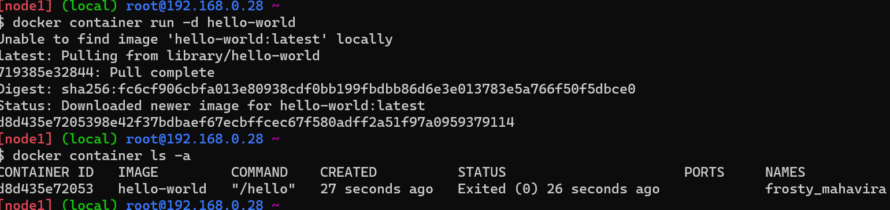
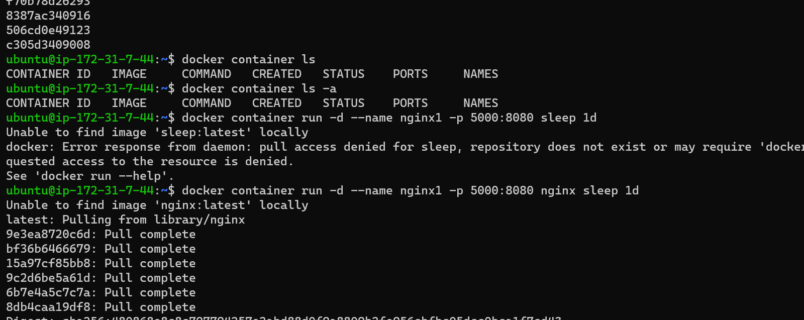
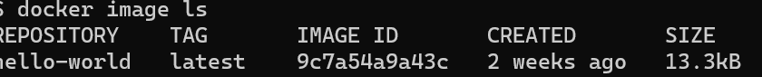
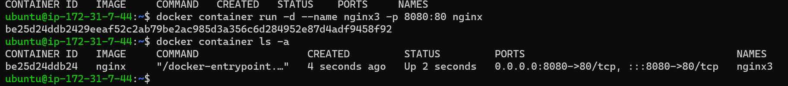
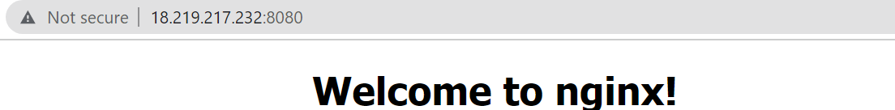
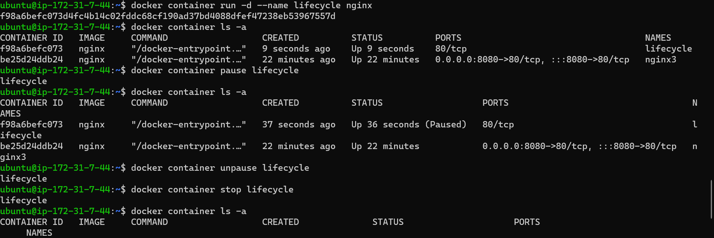

DOCKER JOIP TASK
-----------------

### TASK 1

* Run hello-world docker container and observe the container status

#### command

`docker container run -d hello-world`







* Run the nginx container with name as nginx1 and expose it 
on 8080 port on docker host

#### command
`docker container run -d --name nginx3 -p 8080:80 nginx`



* Explain docker container lifecycle

#### command
 ```
docker container run -d --name lifecycle nginx
docker container pause lifecycle (to pause the lifecycle)
docker container unpause lifecycle (to unpause the lifecycle)
docker container stop lifecycle (to stop the lifecycle)
docker container start lifecycle (to start the lifecycle)

```
* Explain what happens when you run the docker container

The docker run command creates running containers from images and can run commands inside them. When using the docker run command, a container can run a default action 

### Explain the Docker architecture

* Since the docker was relying on lxc which was kernel feature, update to kernel frequently used to break the containers created by docker 
* so docker has created its own compenent called (LIB) container 
* in this generation docker engine was revamped from monolith to multi component architure and the images and container were according to OLI (open container initiative) image spec & run time spec.


