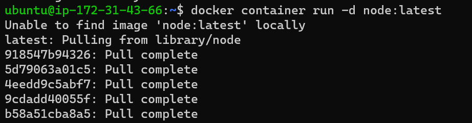
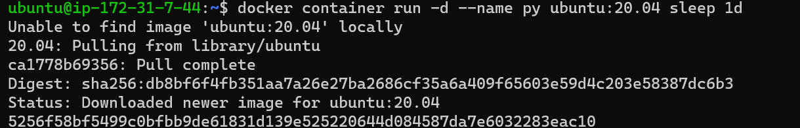

DOCKER JOIP TASK
-----------------

### TASK 1

* Run hello-world docker container and observe the container status

#### command

`docker container run -d hello-world`


* Run the nginx container with name as nginx1 and expose it 
on 8080 port on docker host

#### command
`docker container run -d --name nginx3 -p 8080:80 nginx`


* Explain docker container lifecycle

#### command
 ```
docker container run -d --name lifecycle nginx
docker container pause lifecycle (to pause the lifecycle)
docker container unpause lifecycle (to unpause the lifecycle)
docker container stop lifecycle (to stop the lifecycle)
docker container start lifecycle (to start the lifecycle)

```
* Explain what happens when you run the docker container

The docker run command creates running containers from images and can run commands inside them. When using the docker run command, a container can run a default action 

### Explain the Docker architecture

* Since the docker was relying on lxc which was kernel feature, update to kernel frequently used to break the containers created by docker 
* so docker has created its own compenent called (LIB) container 
* in this generation docker engine was revamped from monolith to multi component architure and the images and container were according to OLI (open container initiative) image spec & run time spec.

* write a Docker file for NodeJS application – expressjs

 Manuel Installation 
---------------------
#### command

'''
docker container run -d node:latest

git clone https://github.com/Azure-Samples/js-e2e-express-server.git 

ls 

cd js-e2e-express-server

sudo apt install npm -y

npm install

npm start 
'''




* Dockerfile

'''
FROM node:latest

RUN apt update

RUN apt install git -y

RUN cd / && git clone https://github.com/Azure-Samples/js-e2e-express-server.git

WORKDIR /js-e2e-express-server

EXPOSE 3000

CMD ["npm","start"]

'''

* create a MySQL dB container from official MySQL image

* login into SQL container and create a table 

* try to create a persisted volume in MySQL container and 
mount that to other

#### commands

'''
 
docker container run -d --name mysqldb -v mysqldb:/var/lib/mysql -e MYSQL_ROOT_PASSWORD=rootroot -e MYSQL_DA
TABASE=employees -e MYSQL_USER=qtdevops -e MYSQL_PASSWORD=rootroot -P mysql:8

docker volume ls (volume created mysqldb)

docker container exec -it mysqldb mysql --password=rootroot (to go iside the container )

use employess 

Insert into Persons Values;

 Select * from Persons;

 docker container rm -f imageid (to delete the container)

  docker container run -d --name mysqldb --mount "source=mysqldb,target=/var/lib/mysql,type=volume" -e MYSQL_ROOT_PASSWORD=rootroot -e MYSQL_DATABASE=employees -e MYSQL_USER=qtdevops -e MYSQL_PASSWORD=rootroot -P mysql:8 (to mount the volume to check after deleting the container still it will be in volume)

docker container exec -it mysqldb mysql --password=rootroot

use employees;

Select * from Persons; (after deleting the container,still it remains in volume mysqldb)


* Create an alpine container in interactive mode and install 
python

#### commands

 '''

  docker container run -it -p --name alpine1 alpine:latest

  apk update 

  apk install python3

  '''

  
  

  * Create a ubuntu container with sleep 1d and then login 
using exec and install python

'''

 docker container run -d --name py ubuntu:20.04 sleep 1d
 docker container exec -it py /bin/bash
 apt update
 apt install python3 -y
 python3 --version
 Python 3.8.10

 '''

 
 
 
 


